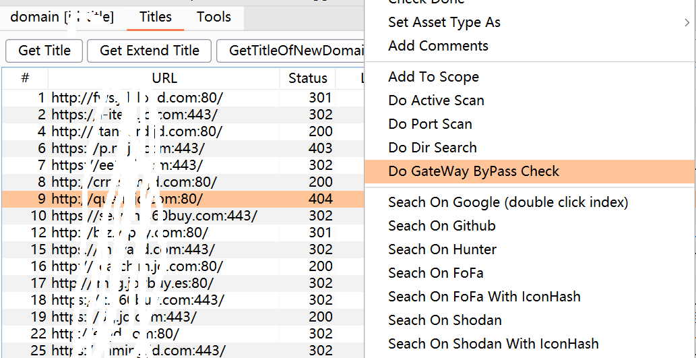
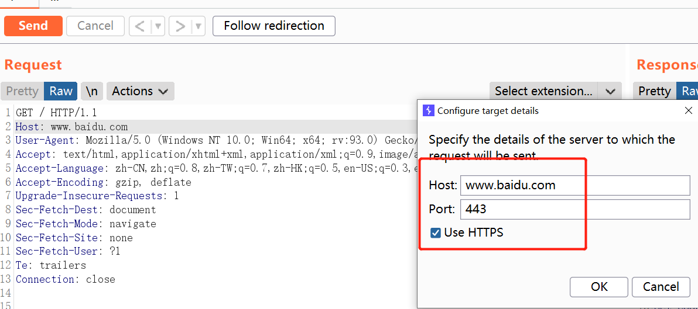
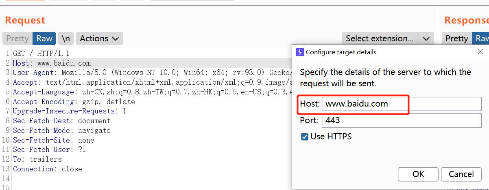

视频教程地址： https://www.bilibili.com/video/BV1ZL4y1i71D/

### 1. change HttpService + Host in header

修改的内容包括 protocol host port （即burp的概念中的httpService）。**请求数据包中的Host字段对应进行修改**。即对domain hunter pro中所有目标资产做一次相同的请求。

使用场景：

1.查找同类应用的多个部署实例。当发现特定的应用出现了漏洞（比如yapi RCE），想要筛选出目前所有资产中的同类应用（所有的yapi），就可以用这个模式实现。

2.用于验证token、cookie在其他站点的有效性。

### 2. change host in HttpService + host in header

修改Service中的Host，**请求数据包中的Host字段对应进行修改**。

使用场景：

1.当知道某个IP主机存在某种漏洞或风险，想要确定器归属，尝试找出其对应的域名的时候。可以通过只修改Host来遍历已经收集到的所有资产。请求结果中，如果某个域名和当前的IP主机具有相同的响应数据包，那么就很可能具有对应关系。

### 3. Change Host in header

只修改请求数据包中的Host字段，目标Service不做修改。

使用场景：

1.用于检测Nginx或者gateway的访问控制不严格，特定host绕过控制访问内网的情况，即host碰撞。目标Service一般是一个Nginx或gateway。

插件中的右键"Do GateWay ByPass Check", 就是一样的功能。而且这个功能使用了所有域名，包括无法解析的域名，有可能某些域名在外网无法解析，但是可以在内网解析的，他们也是有价值的。

### 4. Change HttpService

只修改Service中的Host，其他不做修改。

使用场景：

和情况3一样，也是用于检测Nginx或者gateway的访问控制不严格，即host碰撞。比如某SRC规定某个内网域名或IP可以用作验证SSRF。那么我们就可以使用这种方式，固定Host来测试哪个Nginx或者gateway有问题。

### 5. Change Host in HttpService

只修改HttpService，其他不做修改。

使用场景：

这个模式的使用情况比较稀少，和情况4一样，也是用于检测Nginx或者gateway的访问控制不严格，即host碰撞。但是情况稍微不同，端口和协议是固定的，只有当出现某个特定应用有此漏洞时才会使用。

