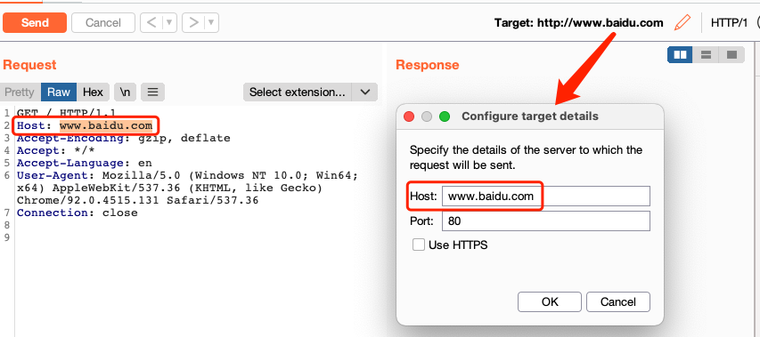
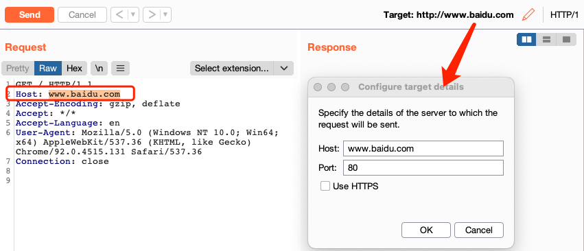

### change HttpService

修改的内容包括 protocol host port （即burp的概念中的httpService）。**请求数据包中的Host字段对应进行修改**。

使用场景：

1.查找同类应用的多个部署实例。当发现特定的应用出现了漏洞（比如yapi RCE），想要筛选出目前所有资产中的同类应用（所有的yapi），就可以用这个模式实现。

2.用于验证token、cookie在其他站点的有效性.

### change host

修改Service中的Host，**请求数据包中的Host字段对应进行修改**。

使用场景：

1.当知道某个IP主机存在某种漏洞或风险，想要确定器归属，尝试找出其对应的域名的时候。可以通过只修改Host来遍历已经收集到的所有资产。请求结果中，如果某个域名和当前的IP主机具有相同的响应数据包，那么就很可能具有对应关系。

### Change Host in header

只修改请求数据包中的Host字段，目标Service不做修改。

使用场景：

1.用于检测Nginx或者gateway的访问控制不严格，特定host绕过控制访问内网的情况。目标Service一般是一个Nginx或gateway。

