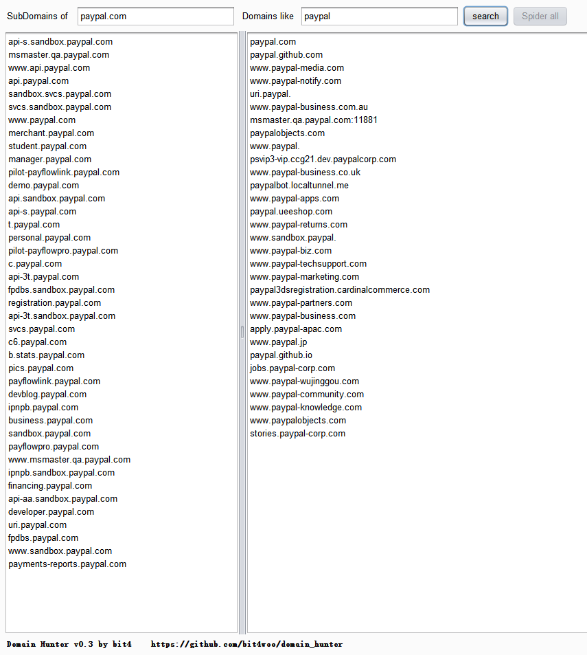
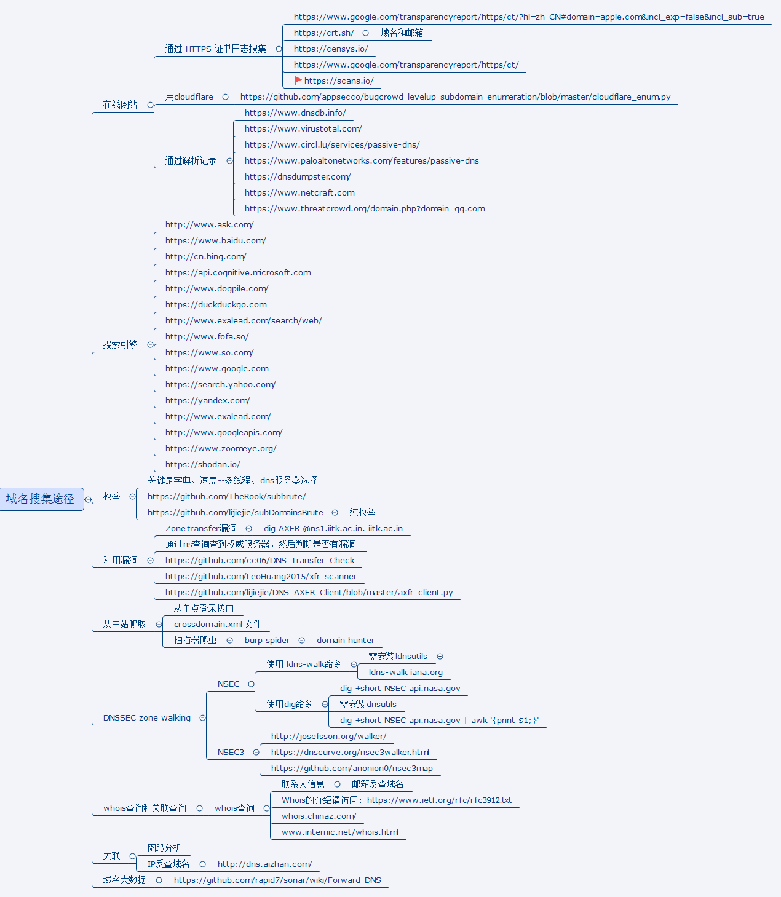

**domain_hunter**

A Burp Suite extender that search *<u>**sub domains and similar domains**</u>* from sitemap. Some times similar domain give you suprise^_^. that's why I care about it.

**usage**

1. download this burp extender from [here](https://github.com/bit4woo/domain_hunter/releases).
2. add it to burp suite. you will see a new tab named “Domain Hunter”, if  no error encountered. 
3. visit your target website(or App) with burp proxy enabled, ensure burp recorded http or https traffic of your target.
4. you can just switch to the "domain hunter" tab, input the domain that you want to search and click "search" button.
5. or you can  run "spider all" first to try to find more subdomains and similiar domains. 

**screenshot**

**change log**

2017-07-28: Add a function to crawl all known subdomains; fix some bug.

**xmind of domain collection**

