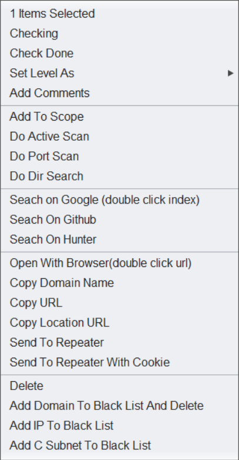

# domain hunter pro


## 功能介绍

### Domains tab：目标管理和信息收集

#### 特点：

- 基于burp流量自动化信息收集（子域名、相关域名、相似域名、邮箱、Java包名）
- 支持对主域名的权威服务器进行域传送（zone transfer）漏洞检测以获取信息
- 支持域名黑名单排除
- 支持IP网段作为目标范围
- 支持IP:port作为目标


### Titles tab：进度管理和操作联动

多线程请求子域名的80或433端口，获取web title\IP地址、CDN

支持排序、搜索（多种搜索方法）

文本搜索、dork搜索


双击用指定浏览器打开对应url地址

双击使用默认浏览器的google进行指定域名或host的搜索



### Tools tab：简单的配置管理和一些小功能


### 右键菜单：


配置管理和小工具

### maven使用

mvn dependency:analyze 找出没有使用的包


### 编程经验

个人理解只要该成员方法不需要与非static的成员打交道，就可以使用static。换句话说，只要该方法的执行与对象本身的状态没有关系，就可以使用static.

通常，我们在定义一个工具类时，一般把它的方法定义成static的，因为这种类只用作工具，只关注他的行为，不关注他的状态，所以不需要定义成员变量。使用这种工具类的方法时无需创建对象，既简单又节省资源。创建对象来调用反而麻烦且浪费资源，所以这种类被设计出来后就干脆不允许创建对象，因为其构造方法被设计成private权限了。比如我们用的Math和Arrays，还有Collections。这三个类时我们java中最常见的三个工具类。

如果一个类，在某个程序中可能只会有一个实例，不会有不同的实例，那么它的成员变量就可以设置为static，方便调用。直接通过类名称去调用，而不用通过对象去调用。
比如 burpExtender这个类，在一个插件中就只有一个实例对象，所以它其中的变量都设置成static后，方便调用，棒！这也是经过多次踩坑得出的经验啊~

正则表示表达式的运用

```
ArrayList<String> result = new ArrayList<String>();
//主要目的是找url        path: '/admin/menu',
String webpack_PATTERN = "([0-9a-z])*"; //TODO 正则表达不正确
Pattern pRegex = Pattern.compile(webpack_PATTERN);
String content = inputTextArea.getText();
Matcher matcher = pRegex.matcher(content);
while (matcher.find()) {//多次查找
	result.add(matcher.group());
}
```


### JSON的序列化和反序列化：

对象序列化和反序列化选gson

Json字符串的处理选JSON(org.json)

```java
package test;

import java.io.File;

import org.apache.commons.io.FileUtils;
import org.json.JSONObject;

import com.alibaba.fastjson.JSON;
import com.google.gson.Gson;


public class testJson {
	public static void main(String args[]) {
		orgJson();
		gson();
		fastjson();
		
		//String json = FileUtils.readFileToString(new File("D:\\user\\01374214\\desktop\\fengdong-system-id.txt"));
	}

	public static void orgJson(){
		User userObject = new User("张三",26,"男"	);
		String userJson = JSONObject.valueToString(userObject);  
		System.out.println(userJson);

		String userJson1 = "{'age':26,'sex':'男','name':'张三'}";
//		User userObject1 = (User) JSONObject.stringToValue(userJson1);
//		System.out.println(userObject1);
	}

	public static void gson(){
		User userObject = new User("张三",26,"男"	);
		Gson gson = new Gson();  
		String userJson = gson.toJson(userObject); 
		System.out.println(userJson);


		String userJson1 = "{'age':26,'sex':'男','name':'张三'}";  
		Gson gson1 = new Gson();  
		User userObject1 = gson1.fromJson(userJson1, User.class);  
		System.out.println(userObject1);
	}

	public static void fastjson() {
		User userObject = new User("张三",26,"男"	);
		String userJson = JSON.toJSONString(userObject);
		System.out.println(userJson);


		String userJson1 = "{'age':26,'sex':'男','name':'张三'}";  
		User userObject1 = JSON.parseObject(userJson1, User.class);
		System.out.println(userObject1);
	}

}

class User {
	String name;
	int age;
	String sex;
	User(){
		
	}
	User(String name,int age,String sex){
		this.name = name;
		this.age = age;
		this.sex = sex;
	}
}
```

