# domain hunter pro

你还在用Excel进行目标管理吗？

你还在为收集目标的信息而烦恼吗？

你还在测试时不停地复制粘贴吗？

那么来试试 [domain hunter pro](https://github.com/bit4woo/domain_hunter_pro) 吧！方便快捷的目标管理、自动化的信息收集、与burp无缝衔接、与外部安全工具联动...

这是一个帮助 SRC白帽子、安全测试工程师提高效率的工具！

我mmmark 师傅的御用工具之一！

# 作者和贡献者

[bit4woo](https://github.com/bit4woo)

mmmark （很多核心思路都来自他宝贵的实战经验！）

## 自行打包使用最新功能

1、如果使用过GitHub Packages，直接运行如下命令即可

```
git clone https://github.com/bit4woo/domain_hunter_pro
cd domain_hunter_pro
mvn package
```

可以在domain_hunter_pro/target/路径下找到对应Jar包。


2、如果没有使用过GitHub Packages，则需要创建或修改/Users/xxxxxx/.m2/setttings.xml 文件

https://github.com/settings/tokens

```xml
<settings xmlns="http://maven.apache.org/SETTINGS/1.0.0"
  xmlns:xsi="http://www.w3.org/2001/XMLSchema-instance"
  xsi:schemaLocation="http://maven.apache.org/SETTINGS/1.0.0
                      http://maven.apache.org/xsd/settings-1.0.0.xsd">

  <activeProfiles>
    <activeProfile>github</activeProfile>
  </activeProfiles>

  <profiles>
    <profile>
      <id>github</id>
      <repositories>
        <repository>
          <id>central</id>
          <url>https://repo1.maven.org/maven2</url>
        </repository>
        <repository>
          <id>github</id>
          <url>https://maven.pkg.github.com/bit4woo/*</url>
          <snapshots>
            <enabled>true</enabled>
          </snapshots>
        </repository>
      </repositories>
    </profile>
  </profiles>

  <servers>
    <server>
      <id>github</id>
      <username>你的GitHub用户名</username>
      <password>你的GitHub access token 通过https://github.com/settings/tokens获取</password>
    </server>
  </servers>

    <properties>  
        <project.build.sourceEncoding>UTF-8</project.build.sourceEncoding>  
        <maven.compiler.encoding>UTF-8</maven.compiler.encoding>  
    </properties> 
</settings>

```

`</repository>` 和`<server>` 中的内容是你需要配置的。` <repository>`中的内容你可以直接复制粘贴。

```xml
       <repository>
          <id>github</id>
          <url>https://maven.pkg.github.com/bit4woo/*</url>
          <snapshots>
            <enabled>true</enabled>
          </snapshots>
        </repository>
```
而`<server>` 中的内容就必须用自己的了。通过https://github.com/settings/tokens获取你的GitHub access token

```
    <server>
      <id>github</id>
      <username>你的GitHub用户名</username>
      <password>你的GitHub access token 通过https://github.com/settings/tokens获取</password>
    </server>
```

完成后再进行步骤一的操作即可。


## 功能介绍

### Domains tab：目标管理和信息收集

- 基于burp流量自动化信息收集（子域名、相关域名、相似域名、邮箱、Java包名）
- 支持对主域名的权威服务器进行域传送（zone transfer）漏洞检测以获取信息
- 支持域名黑名单排除
- 支持IP网段作为目标范围
- 支持IP:port作为目标
- 支持右键在google和GitHub搜索选中内容

### Titles tab：进度管理和操作联动

- 多线程请求子域名的80或433端口，获取web title、IP地址、CDN等目标信息
- 支持排序、搜索、添加备注、标记重要程度、标记是否完成检测
- 搜索方法支持：文本搜索、类似dork搜索（搜索主机名、端口、IP、长度等）
- 双击用指定浏览器打开对应url地址
- 双击使用默认浏览器的google进行指定域名或host的搜索
- 与burp联动处理当前目标网站的请求

### Tools tab：简单的配置管理和一些小功能

- 调用外部默认浏览器或指定浏览器循环打开多个URL地址
- 将多行数据转换成List
- 将多行数据转成数组
- 解析JSON数据，从中提取指定字段的值
- 查找包含指定字符串的行
- IP和网段的互相转换
- HTML、Unicode编码的解码

### 右键菜单：目标管理

- 将选中URL添加到目标管理器中
- 将选中域名添加到目标管理器中
- 在目标管理中查找当前选择URL，如果存在则为其添加备注说明
- 在目标管理中查找当前选择URL，如果存在则设置其重要程度、是否完成检测任务
- 启动一个新的线程，对所有目标网站发送相同的请求，解析其返回包，获取指定目标

# 用户说明书

### 安装

获取软件的Jar包，由于该软件是基于BurpSuite的插件程序。需要与BurpSuite一起使用。


安装后的界面效果

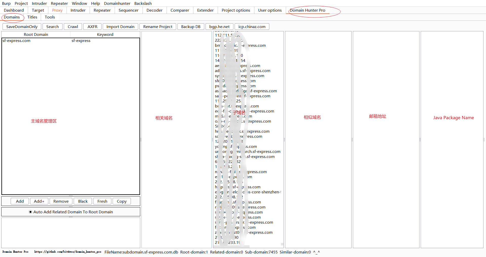

### 项目管理

创建一个新的项目，也可以打开已有的项目文件（xxx.db）


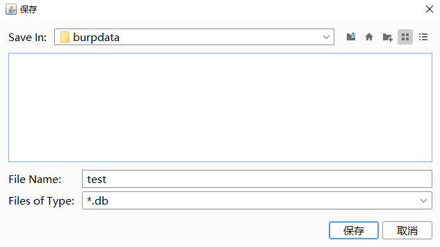


### 管理主域名

主域名是实现目标管理的核心，所有相关域名、子域名、相似域名、邮箱地址、Java包名称都是以主域名作为依据的。比如我们以baidu.com为例

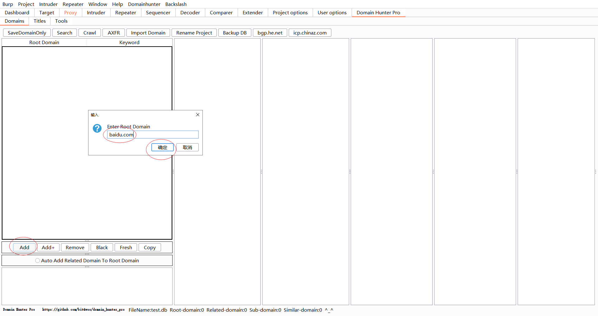

通过代理浏览器访问baidu.com，收集其流量

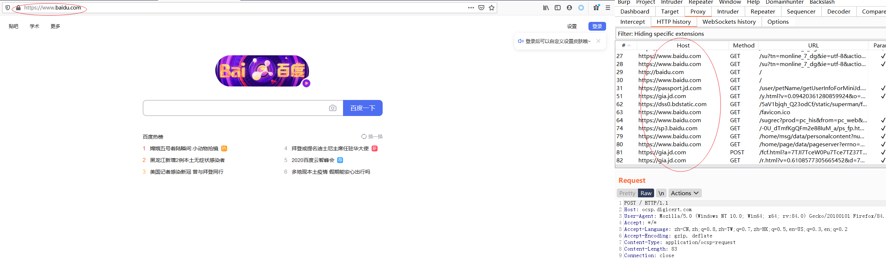

通过search功能，从流量中提取百度相关的所有域名

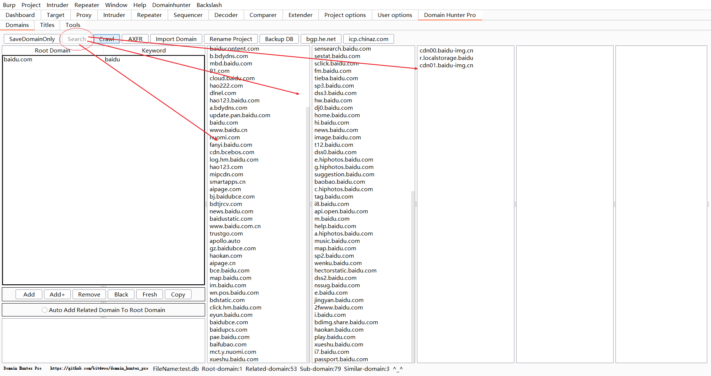

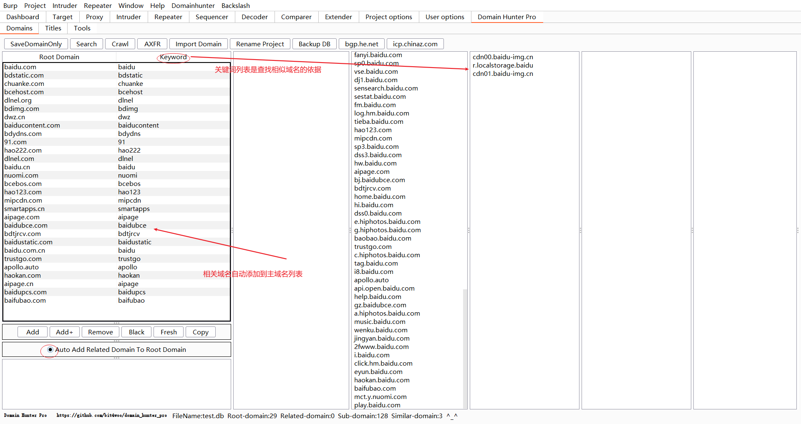


### Titles Tab功能介绍

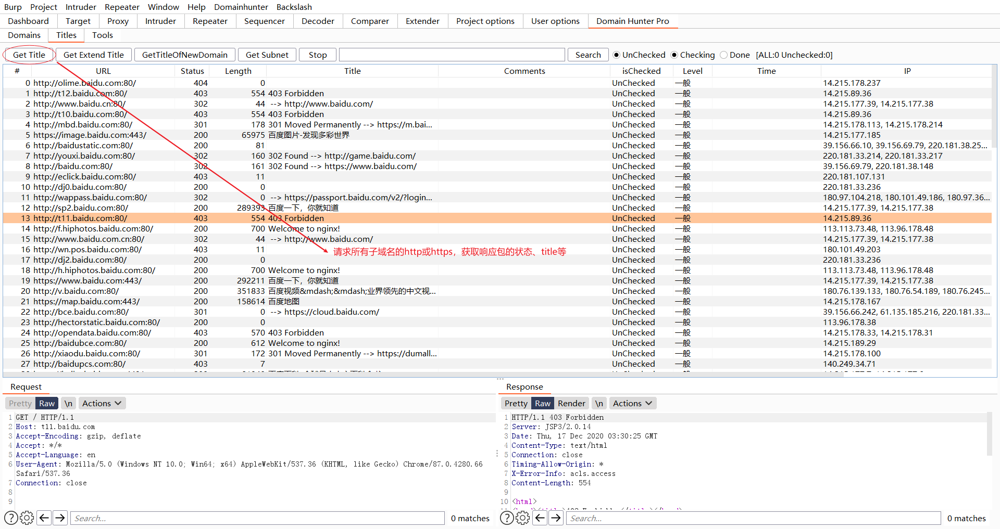


目标网站管理，右键菜单可以和浏览器联动、也可以和burp的功能联动

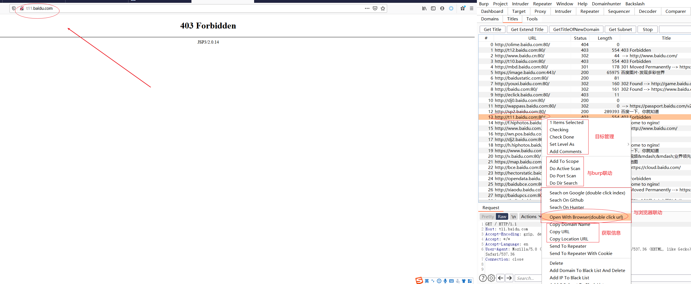

Title功能搜索

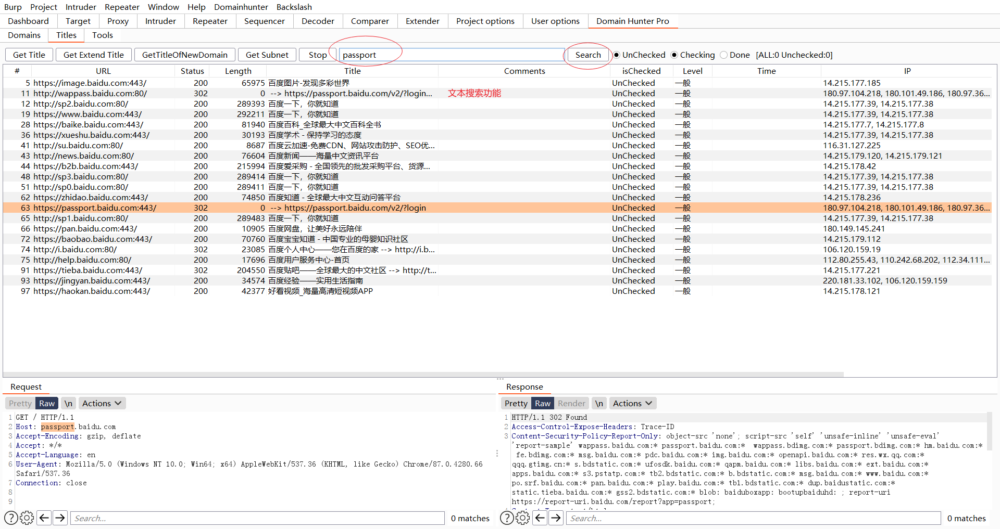


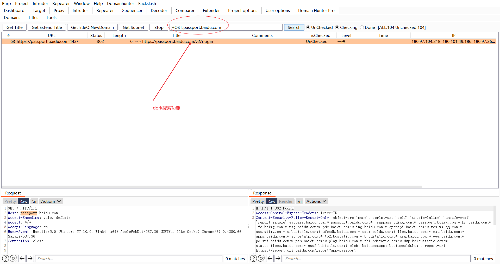

### Tools Tab功能介绍

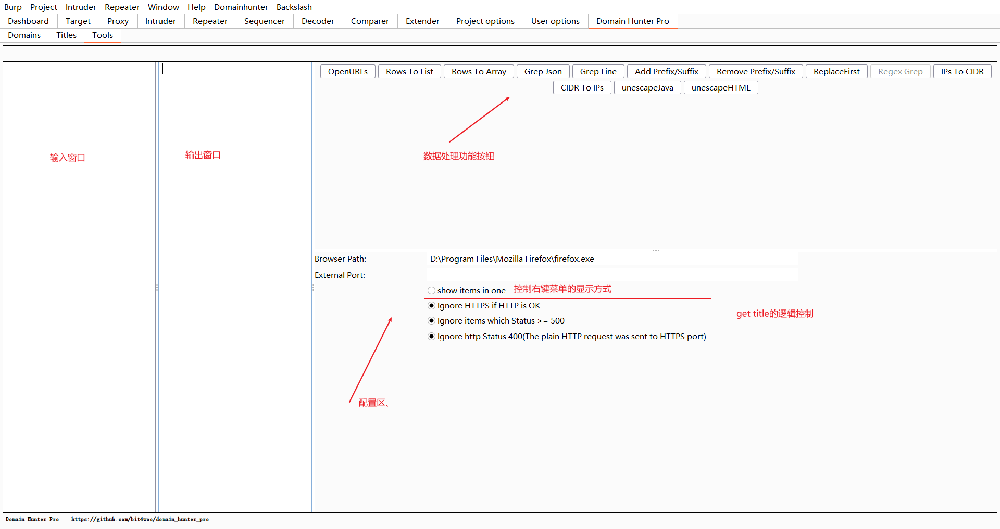


# 一些处理逻辑说明

## IP汇算逻辑

根据目标设定收集到很多子域名自后，可以在title Panel中点击“get title”进行请求。请求之后会获得一些列IP地址。


把IP进行汇总，得出一个个最小网段（不一定是C段）：

```
比如：
8.8.8.8
8.8.8.10
汇算得到
8.8.8.8/30

比如：
8.8.8.8
8.8.8.20
汇算得到
8.8.8.0/27
```


参数汇算的IP集合，应该排除CDN的IP集合

HOST是域名，且ASN不属于目标公司或组织的（多半属于腾讯云、华为云、cloudflare等CDN或云服务提供商），这类资产多半是使用了CDN。这类资产的IP集合，就不应该参数目标网段的汇算，需要自己通过“Add Host To Black List”来标记。

HOST是IP地址，且ASN不属于目标公司或组织的，应当被视作非目标资产，直接删除。

```

```

